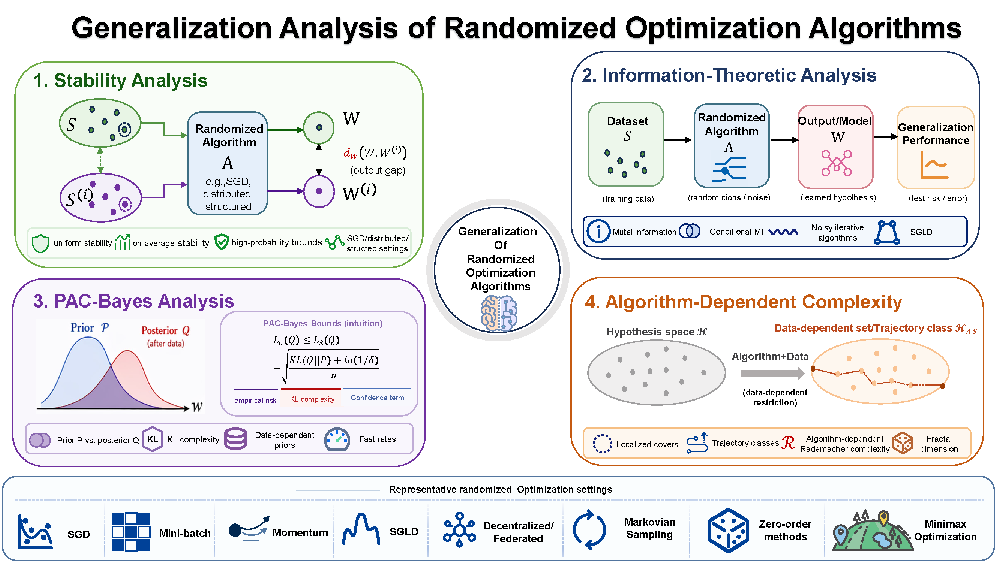

# Generalization Analysis

A collection of papers and datasets for the Generalization in Randomized Optimization Algorithms survey. We are looking forward to other participants to share their papers . If interested, please contact wangjiahuan@nudt.edu.cn. :fire: :fire: :fire: 

- Comprehensive Review

:bell: :bell: :bell: Update at May 2026

```
@article{wangsurvey,
  title={A Survey of Generalization in Randomized Optimization Algorithms},
  author={Wang, Jiahuan and Deng, Xiaoge and Wen, Ziqing and Luo, Ping and Li, Dongsheng and Sun, Tao and Senior, Xinwang Liu}
}
```



# Bookmarks
- [Stability Analysis](#111-)
- [Information-Theoretic Analysis](#222-)
- [PAC-Bayes Analysis](#333-)
- [Algorithm-Dependent Complexity](#444-)

## Stability Analysis <span id="111-">
| Category | **Year**   | **Title**                                                                                     |  **Venue**    |                                       **Paper**                                            |
| ---- |----------------------------------------------------------------------------------|:--------:|:---------------------------------------------------------------------------------:| ---- |
|  | 1978 | **A Finite Sample Distribution-free Performance Bound for Local Discrimination Rules** | The Annals of Statistics | [Link](https://projecteuclid.org/journals/annals-of-statistics/volume-6/issue-3/A-Finite-Sample-Distribution-Free-Performance-Bound-for-Local-Discrimination/10.1214/aos/1176344196.full) |
|  | 1979 | **Distribution-free Inequalities for the Deleted and Holdout Error Estimates** | TIT | [Link](https://ieeexplore.ieee.org/document/1056032/) |
|  | 1979 | **Distribution-free Performance Bounds with the Resubstitution Error Estimate** | TIT | [Link](https://doi.org/10.1109/TIT.1979.1056018) |
|  | 1998 | **Optimization Problems with Perturbations: A Guided Tour** | SIAM | [Link](https://epubs.siam.org/doi/10.1137/S0036144596302644) |
|  | 1999 | **Algorithmic Stability and Sanity-Check Bounds for Leave-One-Out Cross-Validation** | Neural Computation | [Link](https://doi.org/10.1162/089976699300016304) |
|  | 2000 | **Algorithmic Stability and Generalization Performance** | NIPS | [Link](https://papers.neurips.cc/paper/1854-algorithmic-stability-and-generalization-performance) |
|  | 2002 | **Stability and Generalization** | JMLR | [Link](https://jmlr.org/papers/v2/bousquet02a.html) |
|  | 2002 | **Almost-everywhere Algorithmic Stability and Generalization Error** | UAI | [Link](https://arxiv.org/abs/1301.0579) |
|  | 2004 | **General Conditions for Predictivity in Learning Theory** | Nature | [Link](https://www.nature.com/articles/nature02341) |
|  | 2005 | **Stability of Randomized Learning Algorithms** | JMLR | [Link](https://jmlr.org/papers/v6/elisseeff05a.html) |
|  | 2006 | **Learning Theory: Stability is Sufficient for Generalization and Necessary and Sufficient for Consistency of Empirical Risk Minimization** | Computational Mathematics | [Link](https://link.springer.com/article/10.1007/s10444-004-7634-z) |
|  | 2007 | **The Tradeoffs of Large Scale Learning** | NIPS | [Link](https://proceedings.neurips.cc/paper/2007/hash/0d3180d672e08b4c5312dcdafdf6ef36-Abstract.html) |
|  | 2010 | **Learnability, Stability and Uniform Convergence** | JMLR | [Link](http://www.jmlr.org/papers/v11/shalev-shwartz10a.html) |
|  | 2014 | **Understanding Machine Learning: From Theory to Algorithms** | Cambridge University Press | [Link](https://www.cs.huji.ac.il/~shais/UnderstandingMachineLearning/understanding-machine-learning-theory-algorithms.pdf) |
|  | 2022 | **Generalization in Deep Learning** | Cambridge University Press | [Link](https://www.cambridge.org/core/books/mathematical-aspects-of-deep-learning/generalization-in-deep-learning/91C17D047D1CF7B0B80DCF12C52D8C72) |
|  | 2023 | **Mathematical Analysis of Machine Learning Algorithms** | Cambridge University Press | [Link](https://www.cambridge.org/core/books/mathematical-analysis-of-machine-learning-algorithms/EB9BABB05A5C312F19C38E5A01A5ECFC) |
|  | 2015 | **Algorithmic Stability and Uniform Generalization** | NIPS | [Link](https://papers.nips.cc/paper/6019-algorithmic-stability-and-uniform-generalization) |
|  | 2016 | **Train Faster, Generalize Better: Stability of Stochastic Gradient Descent** | ICML | [Link](https://proceedings.mlr.press/v48/hardt16.html) |
|  | 2017 | **A Second-order Look at Stability and Generalization** | COLT | [Link](https://proceedings.mlr.press/v65/maurer17a.html) |
|  | 2018 | **Generalization Bounds for Uniformly Stable Algorithms** | NIPS | [Link](https://arxiv.org/abs/1812.09859) |
|  | 2019 | **High Probability Generalization Bounds for Uniformly Stable Algorithms with Nearly Optimal Rate** | COLT | [Link](https://proceedings.mlr.press/v99/feldman19a.html) |
|  | 2020 | **Fine-grained Analysis of Stability and Generalization for Stochastic Gradient Descent** | ICML | [Link](https://arxiv.org/abs/2006.08157) |
|  | 2020 | **Sharper Bounds for Uniformly Stable Algorithms** | COLT | [Link](https://proceedings.mlr.press/v125/bousquet20b.html) |
|  | 2021 | **Toward Better Generalization Bounds with Locally Elastic Stability** | ICML | [Link](https://arxiv.org/abs/2010.13988) |
|  | 2021 | **Stability and deviation optimal risk bounds with convergence rate $O(1/n)$** | NIPS | [Link](https://openreview.net/forum?id=yaxePRTOhqk) |
|  | 2022 | **Stability of SGD: Tightness Analysis and Improved Bounds** | UAI | [Link](https://proceedings.mlr.press/v180/zhang22b.html) |
|  | 2024 | **High-probability generalization bounds for pointwise uniformly stable algorithms** | ACHA | [Link](https://doi.org/10.1016/j.acha.2024.101632) |
|  | 2025 | **Stability and Sharper Risk Bounds with Convergence Rate $\tilde{O}(1/n^2)$** | NIPS | [Link](https://arxiv.org/abs/2410.09766) |
|  | 2017 | **Generalization Error Bounds for Optimization Algorithms via Stability** | AAAI | [Link](https://ojs.aaai.org/index.php/AAAI/article/view/10919) |
|  | 2018 | **Data-dependent Stability of Stochastic Gradient Descent** | ICML | [Link](https://proceedings.mlr.press/v80/kuzborskij18a.html) |
|  | 2020 | **Stability of Stochastic Gradient Descent on Nonsmooth Convex Losses** | NIPS | [Link](https://proceedings.neurips.cc/paper/2020/hash/2e2c4bf7ceaa4712a72dd5ee136dc9a8-Abstract.html) |
|  | 2021 | **Sharper Generalization Bounds for Learning with Gradient-dominated Objective Functions** | ICLR | [Link](https://openreview.net/forum?id=r28GdiQF7vM) |
|  | 2022 | **Understanding Generalization Error of SGD in Nonconvex Optimization** | Machine Learning | [Link](https://link.springer.com/article/10.1007/s10994-021-06056-w) |
|  | 2023 | **Algorithmic Stability of Heavy-tailed SGD with General Loss Functions** | ICML | [Link](https://proceedings.mlr.press/v202/raj23a.html) |
|  | 2023 | **Exponential Generalization Bounds with Near-Optimal Rates for $ L\_q $-Stable Algorithms** | ICLR | [Link](https://openreview.net/forum?id=1_jtWjhSSkr) |
|  | 2023 | **$L\_2$-Uniform Stability of Randomized Learning Algorithms: Sharper Generalization Bounds and Confidence Boosting** | NIPS | [Link](https://openreview.net/forum?id=GEQZ52oqxa) |
|  | 2023 | **Fine-grained theoretical analysis of federated zeroth-order optimization** | NIPS | [Link](https://proceedings.neurips.cc/paper_files/paper/2023/hash/aaa973f65b98c96e5f850d706464a3c4-Abstract-Conference.html) |
|  | 2024 | **How does black-box impact the learning guarantee of stochastic compositional optimization?** | NIPS | [Link](https://proceedings.neurips.cc/paper_files/paper/2024/hash/c3010e98dc44b6f76df7cf82b5e12c77-Abstract-Conference.html) |
| **Distributed** |          |                                                              |                            |                                                              |
|  | 2019 | **Stability-based Generalization Analysis of Distributed Learning Algorithms for Big Data** | TNNLS | [Link](https://doi.org/10.1109/TNNLS.2019.2910188) |
|  | 2024 | **Stability and Generalization of Asynchronous SGD: Sharper Bounds Beyond Lipschitz and Smoothness** | NIPS | [Link](https://papers.nips.cc/paper_files/paper/2024/hash/0e7e2af2e5ba822c9ad35a37b31b5dd4-Abstract-Conference.html) |
|  | 2025 | **Toward Understanding the Generalizability of Delayed Stochastic Gradient Descent** | TPAMI | [Link](https://doi.org/10.1109/TPAMI.2025.3572251) |
|  | 2020 | **Graph-dependent Implicit Regularisation for Distributed Stochastic Subgradient Descent** | JMLR | [Link](https://jmlr.org/papers/v21/18-638.html) |
|  | 2021 | **Stability and Generalization of Decentralized Stochastic Gradient Descent** | AAAI | [Link](https://ojs.aaai.org/index.php/AAAI/article/view/17173) |
|  | 2022 | **Topology-aware Generalization of Decentralized SGD** | ICML | [Link](https://proceedings.mlr.press/v162/zhu22d.html) |
|  | 2024 | **Improved Stability and Generalization Guarantees of the Decentralized SGD Algorithm** | ICML | [Link](https://arxiv.org/abs/2306.02939) |
|  | 2024 | **Towards Stability and Generalization Bounds in Decentralized Minibatch Stochastic Gradient Descent** | AAAI | [Link](https://ojs.aaai.org/index.php/AAAI/article/view/29477) |
|  | 2025 | **Stability and Generalization of Zeroth-Order Decentralized Stochastic Gradient Descent with Changing Topology** | AAAI | [Link](https://ojs.aaai.org/index.php/AAAI/article/view/33906) |
|  | 2025 | **Stability and Generalization Analysis of Decentralized SGD: Sharper Bounds Beyond Lipschitzness and Smoothness** | ICML | [Link](https://openreview.net/forum?id=g4eTrS2U8o) |
|  | 2025 | **Unveiling the Power of Multiple Gossip Steps: A Stability-Based Generalization Analysis in Decentralized Training** | NIPS | [Link](https://arxiv.org/abs/2510.07980) |
|  | 2023 | **Stability-Based Generalization Analysis of the Asynchronous Decentralized SGD** | AAAI | [Link](https://ojs.aaai.org/index.php/AAAI/article/view/25894) |
|  | 2024 | **On generalization of decentralized learning with separable data** | AISTATS | [Link](https://proceedings.mlr.press/v206/taheri23a.html) |
|  | 2024 | **Stability and generalization of the decentralized stochastic gradient descent ascent algorithm** | NIPS | [Link](https://arxiv.org/abs/2310.20369) |
|  | 2026 | **Stability and Generalization for Distributed SGDA** | TPAMI | [Link](https://doi.org/10.1109/TPAMI.2026.3677027) |
|  | 2025 | **Generalization guarantee of decentralized learning with heterogeneous data** | ICASSP | [Link](https://doi.org/10.1109/ICASSP49660.2025.10889327) |
|  | 2025 | **Generalization error matters in decentralized learning under Byzantine attacks** | TSP | [Link](https://doi.org/10.1109/TSP.2025.3526989) |
|  | 2026 | **Generalization Error Analysis for Attack-Free and Byzantine-Resilient Decentralized Learning with Data Heterogeneity** | TSP | [Link](https://arxiv.org/abs/2506.09438) |
|  | 2025 | **Understanding the Stability-based Generalization of Personalized Federated Learning** | ICLR | [Link](https://openreview.net/forum?id=znhZbonEoe) |
| **Non-iid** |          |                                                              |                            |                                                              |
|  | 2023 | **Sharper bounds for uniformly stable algorithms with stationary mixing process** | ICLR | [Link](https://openreview.net/forum?id=8E5Yazboyh) |
| **SNN** |          |                                                              |                            |                                                              |
|  | 2021 | **Stability \& Generalisation of Gradient Descent for Shallow Neural Networks without the Neural Tangent Kernel** | NIPS | [Link](https://openreview.net/forum?id=JOOsoL_J6Fc) |
|  | 2022 | **Stability and Generalization Analysis of Gradient Methods for Shallow Neural Networks** | NIPS | [Link](https://arxiv.org/abs/2209.09298) |
|  | 2024 | **Stability and Generalization of Adversarial Training for Shallow Neural Networks with Smooth Activation** | NIPS | [Link](https://proceedings.neurips.cc/paper_files/paper/2024/hash/1d35a777e932235b115645d5141e0342-Abstract-Conference.html) |
|          |          |                                                              |                            |                                                              |
|  | 2023 | **Beyond Lipschitz: Sharp Generalization and Excess Risk Bounds for Full-Batch GD** | ICLR | [Link](https://arxiv.org/abs/2204.12446) |
|  | 2025 | **Minibatch and local SGD: Algorithmic stability and linear speedup in generalization** | ACHA | [Link](https://doi.org/10.1016/j.acha.2025.101795) |
|  | 2021 | **Algorithmic Stability and Generalization of An Unsupervised Feature Selection Algorithm** | NIPS | [Link](https://proceedings.neurips.cc/paper/2021/hash/a546203962b88771bb06faf8d6ec065e-Abstract.html) |
|  | 2021 | **Stability and Generalization for Randomized Coordinate Descent** | IJCAI | [Link](https://www.ijcai.org/proceedings/2021/427) |
|  | 2022 | **Stability and Generalization for Markov Chain Stochastic Gradient Methods** | NIPS | [Link](https://arxiv.org/abs/2209.08005) |
|  | 2024 | **General Stability Analysis for Zeroth-Order Optimization Algorithms** | ICLR | [Link](https://openreview.net/forum?id=AfhNyr73Ma) |
|  | 2024 | **Stability and Generalization of Stochastic Compositional Gradient Descent Algorithms** | ICML | [Link](https://arxiv.org/abs/2307.03357) |
|  | 2024 | **On the generalization of stochastic gradient descent with momentum** | JMLR | [Link](https://jmlr.org/papers/v25/22-0068.html) |
|  | 2024 | **Stability and Generalization for Stochastic Recursive Momentum-based Algorithms for (Strongly-)Convex One to $K$-Level Stochastic Optimizations** | ICML | [Link](https://arxiv.org/abs/2407.05286) |
|  | 2025 | **Stability and generalization for stochastic (compositional) optimizations** | IJCAI | [Link](https://www.ijcai.org/proceedings/2025/672) |
|  | 2022 | **Stability Based Generalization Bounds for Exponential Family Langevin Dynamics** | ICML | [Link](https://proceedings.mlr.press/v162/banerjee22a.html) |
| **Minimax** |          |                                                              |                            |                                                              |
|  | 2021 | **Train simultaneously, generalize better: Stability of gradient-based minimax learners** | ICML | [Link](https://arxiv.org/abs/2010.12561) |
|  | 2021 | **Stability and Generalization of Stochastic Gradient Methods for Minimax Problems** | ICML | [Link](https://proceedings.mlr.press/v139/lei21b.html) |
|  | 2021 | **Generalization bounds for stochastic saddle point problems** | AISTATS | [Link](https://proceedings.mlr.press/v130/zhang21a.html) |
|  | 2022 | **What is a Good Metric to Study Generalization of Minimax Learners?** | NIPS | [Link](https://proceedings.neurips.cc/paper_files/paper/2022/hash/f9b8853ea81731f9bfc11820b064de96-Abstract-Conference.html) |
| **Adversarial** |          |                                                              |                            |                                                              |
|  | 2021 | **On the Algorithmic Stability of Adversarial Training** | NIPS | [Link](https://proceedings.neurips.cc/paper/2021/hash/df1f1d20ee86704251795841e6a9405a-Abstract.html) |
|  | 2022 | **Stability Analysis and Generalization Bounds of Adversarial Training** | NIPS | [Link](https://proceedings.neurips.cc/paper_files/paper/2022/hash/637de5e2a7a77f741b0b84bd61c83125-Abstract-Conference.html) |
|  | 2024 | **Uniformly stable algorithms for adversarial training and beyond** | ICML | [Link](https://arxiv.org/abs/2405.01817) |
|  | 2025 | **Algorithmic Stability Based Generalization Bounds for Adversarial Training** | ICLR | [Link](https://openreview.net/forum?id=2GwMazl9ND) |
| **Beyond pointwise** |          |                                                              |                            |                                                              |
|  | 2020 | **Stability and optimization error of stochastic gradient descent for pairwise learning** | AA | [Link](https://doi.org/10.1142/S0219530519400062) |
|  | 2020 | **Sharper Generalization Bounds for Pairwise Learning** | NIPS | [Link](https://proceedings.neurips.cc/paper_files/paper/2020/hash/f3173935ed8ac4bf073c1bcd63171f8a-Abstract.html) |
|  | 2021 | **Generalization Guarantee of SGD for Pairwise Learning** | NIPS | [Link](https://proceedings.neurips.cc/paper/2021/hash/b1301141feffabac455e1f90a7de2054-Abstract.html) |
|  | 2021 | **Simple stochastic and online gradient descent algorithms for pairwise learning** | NIPS | [Link](https://openreview.net/forum?id=VXraeNhj4zI) |
|  | 2025 | **Stability-based Generalization Analysis of Randomized Coordinate Descent for Pairwise Learning** | AAAI | [Link](https://arxiv.org/abs/2503.01530) |
|  | 2023 | **Stability-based Generalization Analysis for Mixtures of Pointwise and Pairwise Learning** | AAAI | [Link](https://ojs.aaai.org/index.php/AAAI/article/view/26205) |
|  | 2023 | **On the stability and generalization of triplet learning** | AAAI | [Link](https://ojs.aaai.org/index.php/AAAI/article/view/25859) |
|  | 2025 | **Error Analysis Affected by Heavy-Tailed Gradients for Non-Convex Pairwise Stochastic Gradient Descent** | AAAI | [Link](https://ojs.aaai.org/index.php/AAAI/article/view/33735) |
| **Meta-learning** |          |                                                              |                            |                                                              |
|  | 2005 | **Algorithmic Stability and Meta-Learning** | JMLR | [Link](https://www.jmlr.org/papers/v6/maurer05a.html) |
|  | 2021 | **On data efficiency of meta-learning** | AISTATS | [Link](https://arxiv.org/abs/2102.00127) |
|  | 2021 | **Generalization Bounds for Meta-Learning via PAC-Bayes and Uniform Stability** | NIPS | [Link](https://proceedings.neurips.cc/paper/2021/hash/1102a326d5f7c9e04fc3c89d0ede88c9-Abstract.html) |
|  | 2021 | **Generalization of Model-Agnostic Meta-Learning Algorithms: Recurring and Unseen Tasks** | NIPS | [Link](https://arxiv.org/abs/2102.03832) |
|  | 2022 | **Fine-Grained Analysis of Stability and Generalization for Modern Meta Learning Algorithms** | NIPS | [Link](https://proceedings.neurips.cc/paper_files/paper/2022/hash/754e862a9329c5af4c4420d9f2e08c42-Abstract-Conference.html) |
|  | 2024 | **On the Stability and Generalization of Meta-Learning** | NIPS | [Link](https://proceedings.neurips.cc/paper_files/paper/2024/hash/984fa4634385c48ab3722d825c57ede0-Abstract-Conference.html) |
|  | 2025 | **On the Stability and Generalization of Meta-Learning: the Impact of Inner-Levels** | NIPS | [Link](https://openreview.net/forum?id=l1L0Yhh6x6) |
|          |          |                                                              |                            |                                                              |
|  | 2018 | **Stability and Generalization of Learning Algorithms that Converge to Global Optima** | ICML | [Link](https://proceedings.mlr.press/v80/charles18a.html) |
|  | 2022 | **On the Generalization of Learning Algorithms that Do Not Converge** | NIPS | [Link](https://proceedings.neurips.cc/paper_files/paper/2022/hash/dd73f39426a03131c38c8d943153d44b-Abstract-Conference.html) |
|  | 2023 | **Stability and Generalization of Stochastic Optimization with Nonconvex and Nonsmooth Problems** | COLT | [Link](https://proceedings.mlr.press/v195/lei23a.html) |
|  | 2024 | **Algorithmic Stability Unleashed: Generalization Bounds with Unbounded Losses** | ICML | [Link](https://proceedings.mlr.press/v235/li24cs.html) |
| **Bilevel** |          |                                                              |                            |                                                              |
|  | 2021 | **Stability and Generalization of Bilevel Programming in Hyperparameter Optimization** | NIPS | [Link](https://openreview.net/forum?id=PvWYUN7t4Tb) |
|  | 2024 | **Fine-grained analysis of stability and generalization for stochastic bilevel optimization** | IJCAI | [Link](https://www.ijcai.org/proceedings/2024/609) |
|  | 2024 | **Lower bounds of uniform stability in gradient-based bilevel algorithms for hyperparameter optimization** | NIPS | [Link](https://proceedings.neurips.cc/paper_files/paper/2024/hash/1b96f01343ff10150e6719eb163e1536-Abstract-Conference.html) |
|  | 2024 | **Exploring the Generalization Capabilities of AID-based Bi-level Optimization** | Arxiv | [Link](https://arxiv.org/abs/2411.16081) |
| **ZO** |          |                                                              |                            |                                                              |
|  | 2022 | **Black-Box Generalization: Stability of Zeroth-Order Learning** | NIPS | [Link](https://proceedings.neurips.cc/paper_files/paper/2022/hash/cce0df2e85795d81e417fc74c9cc29ec-Abstract-Conference.html) |
|  | 2026 | **Stochastic Gradient Methods: Bias, Stability and Generalization** | JMLR | [Link](https://www.jmlr.org/papers/v27/24-0637.html) |
|          |          |                                                              |                            |                                                              |
|  | 2025 | **Generalization Bounds for Model-based Algorithm Configuration** | NIPS | [Link](https://openreview.net/forum?id=bAJCfIywYl) |
|  | 2023 | **Transformers as algorithms: Generalization and stability in in-context learning** | ICML | [Link](https://arxiv.org/abs/2301.07067) |
|  | 2024 | **On the Optimization and Generalization of Multi-head Attention** | TMLR | [Link](https://openreview.net/forum?id=wTGjn7JvYK) |
|          |          |                                                              |                            |                                                              |
|  | 2024 | **Bootstrap SGD: Algorithmic stability and robustness** | AA | [Link](https://arxiv.org/abs/2409.01074) |
|          |          |                                                              |                            |                                                              |
|  | 2022 | **Differentially private sgda for minimax problems** | UAI | [Link](https://arxiv.org/abs/2201.09046) |
| **SAM** |          |                                                              |                            |                                                              |
|  | 2021 | **Towards Understanding Why Lookahead Generalizes Better Than SGD and Beyond** | NIPS | [Link](https://proceedings.neurips.cc/paper/2021/hash/e53a0a2978c28872a4505bdb51db06dc-Abstract.html) |
|  | 2024 | **Improving sharpness-aware minimization by lookahead** | ICML | [Link](https://proceedings.mlr.press/v235/yu24q.html) |
|  | 2024 | **Sharpness-aware Lookahead for accelerating convergence and improving generalization** | TPAMI | [Link](https://doi.org/10.1109/TPAMI.2024.3444002) |
|  | 2025 | **Stabilizing sharpness-aware minimization through a simple renormalization strategy** | JMLR | [Link](https://www.jmlr.org/papers/volume26/24-0065/24-0065.pdf) |
|  | 2025 | **Generalization and Optimization of SGD with Lookahead** | Arxiv | [Link](https://arxiv.org/abs/2509.15776) |
|  | 2026 | **Flat Minima and Generalization: Insights from Stochastic Convex Optimization** | ICML | [Link](https://arxiv.org/abs/2511.03548) |
| **GNN** |          |                                                              |                            |                                                              |
|  | 2019 | **Stability and generalization of graph convolutional neural networks** | KDD | [Link](https://doi.org/10.1145/3292500.3330956) |
|  | 2021 | **The generalization error of graph convolutional networks may enlarge with more layers** | Neurocomputing | [Link](https://doi.org/10.1016/j.neucom.2020.10.109) |
|  | 2025 | **Deeper insights into deep graph convolutional networks: Stability and generalization** | TPAMI | [Link](https://doi.org/10.1109/TPAMI.2025.3616350) |
|  | 2025 | **Adversarial training for graph convolutional networks: stability and generalization analysis** | IJCAI | [Link](https://www.ijcai.org/proceedings/2025/534) |
|          |          |                                                              |                            |                                                              |
## Information-Theoretic Analysis <span id="222-">
| Category | **Year**   | **Title**                                                                                     |  **Venue**    |                                       **Paper**                                            |
| ---- |----------------------------------------------------------------------------------|:--------:|:---------------------------------------------------------------------------------:| ---- |
|  | 1948 | **A mathematical theory of communication** | BSTJ | [Link](https://people.math.harvard.edu/~ctm/home/text/others/shannon/entropy/entropy.pdf) |
|  | 1951 | **On Information and Sufficiency** | AMS | [Link](https://projecteuclid.org/journals/annals-of-mathematical-statistics/volume-22/issue-1/On-Information-and-Sufficiency/10.1214/aoms/1177729694.full) |
|  | 2006 | **Information-theoretic upper and lower bounds for statistical estimation** | TIT | [Link](https://doi.org/10.1109/TIT.2005.864439) |
|  | 2017 | **Exploring generalization in deep learning** | NIPS | [Link](https://arxiv.org/abs/1706.08947) |
|  | 2018 | **Generalization error bounds using Wasserstein distances** | ITW | [Link](https://doi.org/10.1109/ITW.2018.8613445) |
|  | 2023 | **Going deeper, generalizing better: An information-theoretic view for deep learning** | TNNLS | [Link](https://doi.org/10.1109/TNNLS.2023.3297113) |
|  | 2023 | **Understanding the generalization ability of deep learning algorithms: a kernelized Rényi's entropy perspective** | IJCAI | [Link](https://www.ijcai.org/proceedings/2023/405) |
|  | 2016 | **Controlling bias in adaptive data analysis using information theory** | AISTATS | [Link](https://proceedings.mlr.press/v51/russo16.html) |
|  | 2017 | **Information-theoretic analysis of generalization capability of learning algorithms** | NIPS | [Link](https://arxiv.org/abs/1705.07809) |
|  | 2020 | **Tightening mutual information-based bounds on generalization error** | JSAIT | [Link](https://arxiv.org/abs/1901.04609) |
|  | 2022 | **Understanding generalization via leave-one-out conditional mutual information** | ISIT | [Link](https://arxiv.org/abs/2206.14800) |
| **Noisy iterative algorithms** |          |                                                              |                            |                                                              |
|  | 2018 | **Generalization error bounds for noisy, iterative algorithms** | ISIT | [Link](https://arxiv.org/abs/1801.04295) |
|  | 2019 | **Information-theoretic generalization bounds for SGLD via data-dependent estimates** | NIPS | [Link](https://arxiv.org/abs/1911.02151) |
|  | 2021 | **Analyzing the generalization capability of SGLD using properties of Gaussian channels** | NIPS | [Link](https://proceedings.neurips.cc/paper/2021/hash/cb77649f5d53798edfa0ff40dae46322-Abstract.html) |
|  | 2021 | **Time-independent generalization bounds for SGLD in non-convex settings** | NIPS | [Link](https://arxiv.org/abs/2111.12876) |
|  | 2023 | **Time-independent information-theoretic generalization bounds for SGLD** | NIPS | [Link](https://arxiv.org/abs/2311.01046) |
|  | 2021 | **Information-theoretic generalization bounds for stochastic gradient descent** | COLT | [Link](https://arxiv.org/abs/2102.00931) |
|  | 2025 | **Generalization of noisy SGD in unbounded non-convex settings** | ICML | [Link](https://proceedings.mlr.press/v267/dadi25a.html) |
| **Finer information measures** |          |                                                              |                            |                                                              |
|  | 2020 | **Sharpened generalization bounds based on conditional mutual information and an application to noisy, iterative algorithms** | NIPS | [Link](https://arxiv.org/abs/2004.12983) |
|  | 2023 | **Generalization error bounds for noisy, iterative algorithms via maximal leakage** | COLT | [Link](https://arxiv.org/abs/2302.14518) |
| **Limitations and hybrid views** |          |                                                              |                            |                                                              |
|  | 2023 | **Limitations of information-theoretic generalization bounds for gradient descent methods in stochastic convex optimization** | ALT | [Link](https://arxiv.org/abs/2212.13556) |
|  | 2023 | **Information theoretic lower bounds for information theoretic upper bounds** | NIPS | [Link](https://arxiv.org/abs/2302.04925) |
|  | 2021 | **Information-theoretic stability and generalization** | ITDS | [Link](https://doi.org/10.1017/9781108616799.011) |
|  | 2023 | **Sample-conditioned hypothesis stability sharpens information-theoretic generalization bounds** | NIPS | [Link](https://arxiv.org/abs/2310.20102) |

## PAC-Bayes Analysis <span id="333-">
| Category | **Year**   | **Title**                                                                                     |  **Venue**    |                                       **Paper**                                            |
| ---- |----------------------------------------------------------------------------------|:--------:|:---------------------------------------------------------------------------------:| ---- |
|  | 1998 | **Some PAC-Bayesian Theorems** | COLT | [Link](https://dl.acm.org/doi/10.1145/279943.279989) |
|  | 1999 | **PAC-Bayesian Model Averaging** | COLT | [Link](https://dl.acm.org/doi/10.1145/307400.307435) |
|  | 2002 | **PAC-Bayesian generalisation error bounds for Gaussian process classification** | JMLR | [Link](https://jmlr.org/papers/v3/seeger02a.html) |
|  | 2007 | **PAC-Bayesian supervised classification: the thermodynamics of statistical learning** | Arxiv | [Link](https://arxiv.org/abs/0712.0248) |
|  | 2012 | **PAC-Bayes bounds with data dependent priors** | JMLR | [Link](https://jmlr.org/papers/v13/parrado12a.html) |
|  | 2020 | **PAC-Bayes learning bounds for sample-dependent priors** | NIPS | [Link](https://proceedings.neurips.cc/paper_files/paper/2020/hash/2e85d72295b67c5b649290dfbf019285-Abstract.html) |
|  | 2017 | **Computing nonvacuous generalization bounds for deep (stochastic) neural networks with many more parameters than training data** | UAI | [Link](https://arxiv.org/abs/1703.11008) |
|  | 2006 | **PAC-Bayes bounds for the risk of the majority vote and the variance of the Gibbs classifier** | NIPS | [Link](https://papers.neurips.cc/paper/2959-pac-bayes-bounds-for-the-risk-of-the-majority-vote-and-the-variance-of-the-gibbs-classifier) |
|  | 2015 | **Risk bounds for the majority vote: From a PAC-Bayesian analysis to a learning algorithm** | JMLR | [Link](https://jmlr.org/papers/v16/germain15a.html) |
|  | 2021 | **Learning stochastic majority votes by minimizing a PAC-Bayes generalization bound** | NIPS | [Link](https://arxiv.org/abs/2106.12535) |
| **Randomized learning** |          |                                                              |                            |                                                              |
|  | 2017 | **A PAC-Bayesian analysis of randomized learning with application to stochastic gradient descent** | NIPS | [Link](https://arxiv.org/abs/1709.06617) |
|  | 2018 | **PAC-Bayes bounds for stable algorithms with instance-dependent priors** | NIPS | [Link](https://arxiv.org/abs/1806.06827) |
| **Data-dependent** |          |                                                              |                            |                                                              |
|  | 2018 | **Data-dependent PAC-Bayes priors via differential privacy** | NIPS | [Link](https://arxiv.org/abs/1802.09583) |
|  | 2018 | **Entropy-SGD optimizes the prior of a PAC-Bayes bound: Generalization properties of Entropy-SGD and data-dependent priors** | ICML | [Link](https://arxiv.org/abs/1712.09376) |
| | 2023 | **Toward better PAC-bayes bounds for uniformly stable algorithms** | NIPS | [Link](https://openreview.net/pdf?id=F6j16Qr6Vk) |
| | 2025 | **PAC--Bayes guarantees for data-adaptive pairwise learning** | Entropy | [Link](https://www.mdpi.com/1099-4300/27/8/845) |
| **Gradient methods ** |          |                                                              |                            |                                                              |
|  | 2022 | **Generalization bounds for gradient methods via discrete and continuous prior** | NIPS | [Link](https://arxiv.org/abs/2205.13799) |
|  | 2025 | **Generalisation under gradient descent via deterministic PAC-Bayes** | ALT | [Link](https://proceedings.mlr.press/v272/clerico25a.html) |
|  | 2020 | **Normalized flat minima: Exploring scale invariant definition of flat minima for neural networks using PAC-Bayesian analysis** | ICML | [Link](https://proceedings.mlr.press/v119/tsuzuku20a.html) |

## Algorithm-Dependent Complexity <span id="444-">
| Category | **Year**   | **Title**                                                                                     |  **Venue**    |                                       **Paper**                                            |
| ---- |----------------------------------------------------------------------------------|:--------:|:---------------------------------------------------------------------------------:| ---- |
|  | 2019 | **Uniform convergence may be unable to explain generalization in deep learning** | NIPS | [Link](https://arxiv.org/abs/1902.04742) |
|  | 2018 | **Uniform convergence of gradients for non-convex learning and optimization** | NIPS | [Link](https://arxiv.org/abs/1810.11059) |
|  | 2020 | **In defense of uniform convergence: Generalization via derandomization with an application to interpolating predictors** | ICML | [Link](https://proceedings.mlr.press/v119/negrea20a.html) |
|  | 2023 | **Fantastic generalization measures are nowhere to be found** | Arxiv | [Link](https://arxiv.org/abs/2309.13658) |
| **Compression** |          |                                                              |                            |                                                              |
|  | 2018 | **Stronger generalization bounds for deep nets via a compression approach** | ICML | [Link](https://arxiv.org/abs/1802.05296) |
| **Localized and algorithm-dependent complexity** |          |                                                              |                            |                                                              |
|  | 2022 | **Generalization bounds for stochastic gradient descent via localized $\varepsilon$-covers** | NIPS | [Link](https://arxiv.org/abs/2209.08951) |
|  | 2023 | **Generalization guarantees via algorithm-dependent Rademacher complexity** | COLT | [Link](https://proceedings.mlr.press/v195/sachs23a.html) |
|  | 2024 | **Uniform generalization bounds on data-dependent hypothesis sets via PAC-Bayesian theory on random sets** | JMLR | [Link](https://arxiv.org/abs/2404.17442) |
| **Fractal and geometric complexity** |          |                                                              |                            |                                                              |
|  | 2020 | **Hausdorff dimension, heavy tails, and generalization in neural networks** | NIPS | [Link](https://arxiv.org/abs/2006.09313) |
|  | 2021 | **Fractal structure and generalization properties of stochastic optimization algorithms** | NIPS | [Link](https://arxiv.org/abs/2106.04881) |
|  | 2021 | **Intrinsic dimension, persistent homology and generalization in neural networks** | NIPS | [Link](https://arxiv.org/abs/2111.13171) |
|  | 2021 | **Heavy tails in SGD and compressibility of overparametrized neural networks** | NIPS | [Link](https://arxiv.org/abs/2106.03795) |
|  | 2022 | **Generalization bounds using lower tail exponents in stochastic optimizers** | ICML | [Link](https://arxiv.org/abs/2108.00781) |
|  | 2023 | **Generalization bounds using data-dependent fractal dimensions** | ICML | [Link](https://proceedings.mlr.press/v202/dupuis23a.html) |
| **Boundary examples** |          |                                                              |                            |                                                              |
|  | 2024 | **Convex SGD: Generalization without early stopping** | Arxiv | [Link](https://arxiv.org/abs/2401.04067) |
|  | 2016 | **Generalization of ERM in stochastic convex optimization: The dimension strikes back** | NIPS | [Link](https://arxiv.org/abs/1608.04414) |
|  | 2024 | **The dimension strikes back with gradients: Generalization of gradient methods in stochastic convex optimization** | Arxiv | [Link](https://arxiv.org/abs/2401.12058) |
|  | 2024 | **Towards sharper risk bounds for minimax problems** | IJCAI | [Link](https://www.ijcai.org/proceedings/2024/630) |
| |  |  |  |  |
